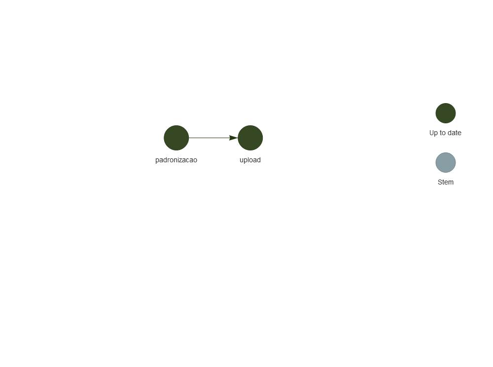

# CNEFE padronizado

Este repositório contém o código utilizado na padronização dos endereços
listados no CNEFE 2022. Essa padronização visa principalmente subsidiar
o pacote [`{geocodebr}`](https://github.com/ipeaGIT/geocodebr/), que faz
a geolocalização de endereços a partir das informações do CNEFE.

A divulgação e publicização desse repositório tem como objetivo garantir
a transparência do trabalho realizado. O código necessário para realizar
a padronização está disposto como explicado na seção *[Estrutura dos
arquivos](#estrutura-dos-arquivos)* e pode ser utilizado para reproduzir
os resultados finais conforme as instruções apresentadas na seção
*[Rodando o código](#rodando-o-código)*. No entanto, nós **não**
garantimos a total reprodutibilidade do trabalho, uma vez que usamos o
pacote interno `{ipeadatalake}` (apenas disponível na rede interna do
IPEA) para fazer a leitura dos dados do CNEFE. Além disso, o
comportamento das funções utilizadas no código está condicionado a
diversos fatores, como a versão instalada do R e o sistema operacional
em que o código é rodado. Ao final deste documento nós listamos
informações relevantes do *[Ambiente de
trabalho](#ambiente-de-trabalho)* usado no desenvolvimento do estudo.

## Instalação

A primeira etapa para rodar esse projeto é clonar o repositório. Para
isso, use o comando:

    git clone https://github.com/ipeaGIT/padronizacao_cnefe.git

## Estrutura dos arquivos

Os arquivos que compõem este repositório foram organizados de forma que
cada pasta armazene arquivos com uma determinada finalidade:

- `R/` - código utilizado no projeto;
- `figures/` - figuras geradas ao rodar o código do projeto;
- `_targets/` - pasta utilizada pelo pacote `{targets}` para manter
  controle do fluxo de trabalho do projeto;
- `renv/` - pasta utilizada pelo pacote `{renv}` para manter controle
  das dependências do projeto.

## Rodando o código

Este projeto utiliza o pacote
[`{renv}`](https://rstudio.github.io/renv/index.html) para fazer a
gestão de dependências do código, garantindo que os mesmos pacotes
usados em seu desenvolvimento sejam usados na cópia a ser reproduzida em
seu computador. Para instalar as dependências, abra o projeto e rode o
seguinte comando:

``` r
renv::restore()
```

Nesse momento, uma série de pacotes serão listados e o `{renv}` pedirá
para confirmar se você deseja instalá-los. Após essa confirmação, os
pacotes serão instalados.

O pacote [`{targets}`](https://github.com/ropensci/targets), por sua
vez, faz a gestão do fluxo de trabalho do projeto. O arquivo
`_targets.R` configura as dependências entre as diferentes funções
internas usadas no código, de forma a garantir que o resultado de uma
determinada função esteja sempre sincronizado com o resultado de suas
dependências (por exemplo, se configuramos que o resultado da função
`b()` depende do valor da função `a()`, precisamos atualizar `b()` no
caso de uma atualização de `a()`).

Rode o arquivo `_targets.R` com a função `source()` para carregar as
bibliotecas necessárias e configurar as dependências entre as funções e
os objetos usados no projeto. Para visualizar as dependências do código
na forma de um grafo dirigido, use o seguinte comando:

``` r
source("_targets.R")

tar_visnetwork(targets_only = TRUE)
```

    #> - The project is out-of-sync -- use `]8;;ide:run:renv::status()renv::status()]8;;` for details.


Note que todos os vértices do grafo estão marcados como desatualizados.
Para que eles sejam marcados como atualizados, é necessário rodar o
*pipeline* do projeto respeitando suas dependências (nos termos do
exemplo anterior, rodando primeiro a função `a()` e depois a `b()`, que
depende dos resultados da `a()`). Para isso, use o seguinte comando:

``` r
tar_make()
```

Caso a execução deste comando ocorra como esperado, sem erros, o fluxo
de trabalho do projeto será marcado como atualizado. O mesmo comando de
visualização do grafo de dependências usado anteriormente pode ser usado
para checar se os vértices estão atualizados:

``` r
tar_visnetwork(targets_only = TRUE)
```

    #> - The project is out-of-sync -- use `]8;;ide:run:renv::status()renv::status()]8;;` for details.



## Ambiente de trabalho

<details>
<summary>
Clique aqui para ver as informações do ambiente de trabalho utilizado no
desenvolvimento do projeto.
</summary>

``` r
info <- sessioninfo::session_info()
info$packages$library <- NULL

info
#> ─ Session info ───────────────────────────────────────────────────────────────
#>  setting  value
#>  version  R version 4.4.1 (2024-06-14 ucrt)
#>  os       Windows Server 2022 x64 (build 20348)
#>  system   x86_64, mingw32
#>  ui       RTerm
#>  language en
#>  collate  Portuguese_Brazil.utf8
#>  ctype    Portuguese_Brazil.utf8
#>  tz       America/Sao_Paulo
#>  date     2024-11-07
#>  pandoc   3.1.1 @ C:/Program Files/RStudio/resources/app/bin/quarto/bin/tools/ (via rmarkdown)
#> 
#> ─ Packages ───────────────────────────────────────────────────────────────────
#>  package     * version date (UTC) lib source
#>  backports     1.5.0   2024-05-23 []  CRAN (R 4.4.0)
#>  base64url     1.4     2018-05-14 []  CRAN (R 4.4.1)
#>  callr         3.7.6   2024-03-25 []  CRAN (R 4.4.1)
#>  cli           3.6.3   2024-06-21 []  CRAN (R 4.4.1)
#>  codetools     0.2-20  2024-03-31 []  CRAN (R 4.4.1)
#>  data.table    1.16.2  2024-10-10 []  CRAN (R 4.4.1)
#>  digest        0.6.37  2024-08-19 []  RSPM
#>  dplyr       * 1.1.4   2023-11-17 []  RSPM (R 4.4.0)
#>  evaluate      1.0.1   2024-10-10 []  CRAN (R 4.4.1)
#>  fansi         1.0.6   2023-12-08 []  CRAN (R 4.4.1)
#>  fastmap       1.2.0   2024-05-15 []  RSPM
#>  generics      0.1.3   2022-07-05 []  RSPM (R 4.4.0)
#>  glue          1.8.0   2024-09-30 []  CRAN (R 4.4.1)
#>  highr         0.11    2024-05-26 []  CRAN (R 4.4.1)
#>  htmltools     0.5.8.1 2024-04-04 []  RSPM
#>  htmlwidgets   1.6.4   2023-12-06 []  RSPM
#>  igraph        2.1.1   2024-10-19 []  CRAN (R 4.4.1)
#>  jsonlite      1.8.9   2024-09-20 []  RSPM
#>  knitr         1.48    2024-07-07 []  CRAN (R 4.4.1)
#>  lifecycle     1.0.4   2023-11-07 []  CRAN (R 4.4.1)
#>  magrittr      2.0.3   2022-03-30 []  CRAN (R 4.4.1)
#>  pak           0.8.0   2024-08-26 []  RSPM
#>  pillar        1.9.0   2023-03-22 []  CRAN (R 4.4.1)
#>  pkgconfig     2.0.3   2019-09-22 []  CRAN (R 4.4.1)
#>  processx      3.8.4   2024-03-16 []  CRAN (R 4.4.1)
#>  ps            1.8.1   2024-10-28 []  CRAN (R 4.4.1)
#>  R6            2.5.1   2021-08-19 []  CRAN (R 4.4.1)
#>  renv          1.0.11  2024-10-12 []  CRAN (R 4.4.1)
#>  rlang         1.1.4   2024-06-04 []  CRAN (R 4.4.1)
#>  rmarkdown     2.29    2024-11-04 []  RSPM
#>  rstudioapi    0.17.1  2024-10-22 []  RSPM
#>  secretbase    1.0.3   2024-10-02 []  CRAN (R 4.4.1)
#>  sessioninfo   1.2.2   2021-12-06 []  RSPM
#>  targets     * 1.8.0   2024-10-02 []  CRAN (R 4.4.1)
#>  tibble        3.2.1   2023-03-20 []  CRAN (R 4.4.1)
#>  tidyselect    1.2.1   2024-03-11 []  CRAN (R 4.4.1)
#>  utf8          1.2.4   2023-10-22 []  CRAN (R 4.4.1)
#>  vctrs         0.6.5   2023-12-01 []  CRAN (R 4.4.1)
#>  visNetwork    2.1.2   2022-09-29 []  RSPM
#>  webshot       0.5.5   2023-06-26 []  RSPM
#>  withr         3.0.2   2024-10-28 []  CRAN (R 4.4.1)
#>  xfun          0.49    2024-10-31 []  CRAN (R 4.4.1)
#>  yaml          2.3.10  2024-07-26 []  CRAN (R 4.4.1)
#> 
#> 
#> ──────────────────────────────────────────────────────────────────────────────
```

</details>
